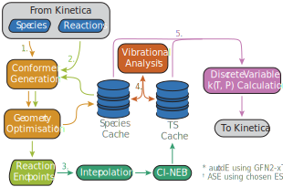

# Kinetic Calculators

Kinetica allows for any and all rate constant expressions to be used within kinetic simulations through its modular kinetic calculator interface. This allows users and developers alike to quickly define a set of functions which are dependent on a CRN (through a [`SpeciesData`](@ref) and an [`RxData`](@ref)) and some arbitrary experimental conditions which the simulation takes place under, such as temperature and pressure, and to calculate rate constants. For more information on how kinetic calculators are implemented, see [Calculator Interface](@ref).

Kinetica features a couple of base calculators. The [`PrecalculatedArrheniusCalculator`](@ref) relies on having Arrhenius prefactors and activation energies precalculated for every reaction in a CRN, and serves mostly as a test calculator and an implementation example. The [`ASENEBCalculator`](@ref) is a much more full-featured calculator that uses the nudged elastic band (NEB) method to determine transition state theory (TST) rate constants from first principles at solution time.

Other calculators are provided as modular addon packages that extend Kinetica.jl (e.g. KineticaKPM.jl). Some calculators have extensive dependencies, so this modularisation allows for picking and choosing only the calculators required for a specific project rather than having every available calculator in one bloated Julia/Python environment.

## Manually Calling Calculators

The examples below all show how calculators can be manually called to calculate rate constants. This is useful when these values are required, e.g. for analysis, but is not required during kinetic simulations. Passing a calculator into [`explore_network`](@ref) or [`solve_network`](@ref) via a [`VariableODESolve`](@ref) struct (see the ['Running the Simulation' section of Getting Started](@ref "Running the Simulation")) is enough to set up the calculator and evaluate rate constants as many times as is required by the simulation.

In the event that a calculator is required to be called manually, the process is very simple. Once the calculator has been instantiated, it should be passed to its `setup_network!` method. All kinetic calculators implement such a function, which checks the values provided to the calculator are compatible with a given [`SpeciesData`](@ref) and [`RxData`](@ref) and does any necessary pre-calculation such that the calculator can perform the minimum computation when rate constants are requested. Once setup, the calculator object can be called as a functor with its implemented experimental conditions as keyword arguments to evaluate the rate constants of all reactions in the given CRN at the provided values of the conditions. Examples of this process can be found below.

## Calculator Showcase

In all of the examples below, `sd` and `rd` refer to instances of [`SpeciesData`](@ref) and [`RxData`](@ref) respectively. These are the internal representations of species and reactions within Kinetica, see the page on [CRN Representation](@ref) for further information.

!!! note "This section is growing!"
    Kinetica currently has only a handful of kinetic calculators available. We are adding more as we need them, but if you require a specific implementation then please let us know on our [Issues page](https://github.com/Kinetica-jl/Kinetica.jl/issues). Alternatively, calculators aren't too hard to implement yourself, and custom calculators can be dropped into kinetic simulations just like the ones presented here. See [Calculator Interface](@ref) for details.

### Kinetica.jl

#### [`PrecalculatedArrheniusCalculator`](@ref)

This calculator is dependent on temperature as an experimental condition, and takes a vector of Arrhenius prefactors and a vector of activation energies, each with an entry for each reaction in a given CRN, and calculates rate constants with the Arrhenius equation. It also accepts an optional maximum rate constant `k_max` which takes over through partial diffusion control. The calculated rate constant for reaction ``i`` is therefore: 

```math
k_i = \dfrac{1}{\dfrac{1}{k_{\text{max}}} + \dfrac{1}{A_ie^{-\dfrac{E_i}{RT}}}}
```

where ``A_i`` is the ``i``th Arrhenius prefactor, ``E_i`` is the ``i``th activation energy, ``R`` is the ideal gas constant and ``T`` is the temperature, which must be passed in as a parameter.

##### Example:

```julia
# Get Arrhenius prefactors A and activation energies Ea from elsewhere...
# Length of A and Ea should match rd.nr.
calc = PrecalculatedArrheniusCalculator(Ea, A; k_max = 1e12)
setup_network!(sd, rd, calc)
k = calc(; T = 300.0)
```

#### [`ASENEBCalculator`](@ref)

This calculator is dependent on both temperature and pressure as experimental conditions. At CRN solution time, it uses the [ASE](https://wiki.fysik.dtu.dk/ase/) Python package to perform the following workflow for every reaction in the network:

* The [autodE](https://github.com/duartegroup/autodE) Python package is used to sample conformers of all active species - the species in a given [`SpeciesData`](@ref) which currently feature in the reactions of the given [`RxData`](@ref) - using the GFN2-xTB method.
* The most stable conformers are optimised to an energetic minimum on the PES specified by the energy/force calculator passed to ASE.
* Optimised geometries and other properties enter a purpose-built cache for chemical species data. All reactions are re-enumerated and any multi-molecular reaction endpoint geometries are created by autodE non-covalent conformer generation and ASE optimisation with the same energy/force calculator.
* For each reaction, the endpoints are interpolated between to generate an initial reaction path, then CI-NEB is run until forces converge across the path. Optimised transition state (TS) geometries enter their own reaction-indexed cache alongside a number of properties.
* All relevant species and TSs undergo vibrational analysis within ASE with the same energy/force calculator to obtain vibrational energies, which are added to their respective caches.
* The information in the caches is used to calculate TST rate constants that can be used directly in kinetic simulations. Currently, this is limited to working with the discrete rate update formalism only due to the complexity of the rate constant expression (see [ODE Solution](@ref) for details).



This calculator is theoretically compatible with any energy/force calculator implemented in ASE, although each needs an interface to let Kinetica know how to construct the Python `Calculator` interface at runtime. Kinetica calls these interfaces calculator *builders*; right now, three are implemented:

* [`EMTBuilder`](@ref) allows for calculations to be performed with a fast, inexpensive EMT calculator. This method is not intended to be accurate enough for kinetics, and is mostly used for quick tests.
* [`NWChemDFTBuilder`](@ref) implements DFT calculations through the [NWChem](https://nwchemgit.github.io/index.html) code, with any of its supported XC functionals and basis sets. It allows for passing a subset of input parameters to the ASE `Calculator`.
* [`FHIAimsBuilder`](@ref) implements DFT calculations through the [FHI-aims](https://fhi-aims.org/) code, with any of its supported XC functionals and basis set options. It allows for passing a subset of input parameters to the ASE `Calculator`.

Other builders can be added with minimal effort, including those for packages which extend ASE. An example of this is shown in the page for [ASE Calculator Builders](@ref).

Of course, running CI-NEB calculations under DFT is a resource-intensive and costly task, especially over potentially thousands of reactions in a CRN. The [`ASENEBCalculator`](@ref) therefore implements a few precautions and quality of life features:

* Completed conformer generations, species and endpoint optimisations, CI-NEB TSs and vibrational energies are saved to disk to allow for quick restarts if calculations fail.
* Save files for reactions are reusable across different CRNs, as they are saved under unique reaction hashes that represent the reactants and products of a reaction. For example, if the reaction `CC -> C=C + [H][H]` was explored and characterised in one CRN, the TS geometry and properties could be reused without having to redo the calculation provided the [`ASENEBCalculator`](@ref) is pointed to the same calculation directory.
* If a reaction is being characterised and its reverse reaction already has a converged TS in the TS cache, this is copied to avoid redoing an expensive calculation. If the reverse reaction's NEB was unsuccessful, the forward reaction undergoes NEB as usual. If this converges to a TS, it is copied back to the unsuccessful reverse reaction's cache too. If both forward and reverse reaction calculations fail, both reactions are removed from the CRN.

The calculator calculates rate constants with the Eyring equation:

```math
k = \dfrac{k_B T}{h} e^{-\dfrac{\Delta G^{\ddagger}}{RT}} = \dfrac{k_B T}{h} e^{\dfrac{\Delta S^{\ddagger}\left( T, P \right)}{R}} e^{-\dfrac{\Delta H^{\ddagger}\left( T \right)}{RT}}
```

where ``\Delta S^{\ddagger}\left( T, P \right)`` and ``\Delta H^{\ddagger}\left( T \right)`` are the entropy and enthalpy changes of activation, calculated as properties of the reactants and the transition state. If these values are desired outside of the final, rate constants, [`calculate_entropy_enthalpy`](@ref) can be called.

##### Example:

```julia
builder = EMTBuilder()
calcdir_head = "/path/to/working_dir_for_calcs"
calc = ASENEBCalculator(builder, calcdir_head; n_images=15, neb_optimiser="fire")
setup_network!(sd, rd, calc)
k = calc(; T = 300.0, P = 1e5)
```


### KineticaKPM.jl

The calculators in KineticaKPM all use [KineticPredictorModel](https://github.com/joegilkes/KineticPredictorModel) (KPM), a Python code for predicting activation energies using a simple neural network, as a driver for rate constant calculation using the Arrhenius equation. Arrhenius prefactors are estimated through a variety of methods depending on the calculator used.

The calculators in this package require an instance of [`KPMRun`](@ref), which acts as an interface to the KPM package and handles conversion of the current CRN into reactions which it can predict activation energies for. This is simply constructed by calling the following:

```julia
kpm = KPMRun("/path/to/kpm_model.npz")
```

where the KPM model `.npz` file should be obtained separately through training a model with the main Python package.

All calculators in this package accept an optional maximum rate constant `k_max` which takes over through partial diffusion control. They are also all capable of returning rate constants with [Measurements.jl](https://juliaphysics.github.io/Measurements.jl/stable/) uncertainties, derived from the standard deviation between activation energy predictions within an ensemble of neural networks. While these can be used manually, they are not currently supported within any of the ODE solution methods in Kinetica.

#### [`KPMBasicCalculator`](@ref)

This calculator is dependent on temperature as an experimental condition. It estimates Arrhenius prefactors as

```math
A = \dfrac{RT}{h}
```

for all reactions, where ``R`` is the ideal gas constant, ``T`` is the temperature, which must be passed as a parameter, and ``h`` is the Planck constant. The resulting rate constant for reaction ``i`` is therefore:

```math
k_i = \dfrac{1}{\dfrac{1}{k_{\text{max}}} + \dfrac{1}{\dfrac{RT}{h}e^{-\dfrac{E_i}{RT}}}}.
```

##### Example:

```julia
# Set up KPMRun object before this...
calc = KPMBasicCalculator(kpm; uncertainty = false, k_max = 1e12)
setup_network!(sd, rd, calc)
k = calc(; T = 300.0)
```

#### [`KPMCollisionCalculator`](@ref)

This calculator is dependent on temperature as an experimental condition. It estimates Arrhenius prefactors using collision theory, a hard-sphere approximation of collision frequency. All unimolecular reactions therefore require a collision partner for reactions to occur, which can be passed through the `inert_species` argument. If this is given, `setup_network!` will modify all unimolecular reactions to become bimolecular with the provided collision partners. Otherwise, an average collision partner will be calculated from the species in the CRN and rates will be calculated assuming a concentration of 1 mol dm``^{-3}`` of this 'species'.

The calculator computes two properties for each reaction: the reduced mass ``\mu`` and the collision cross section ``\sigma``. For collision partners ``A`` and ``B``, these are defined as

```math
\mu = \dfrac{m_A m_B}{m_A + m_B} \\
\sigma = \pi \left( r_A + r_B \right)^2
```

where ``m_A`` and ``m_B`` are the masses of ``A`` and ``B`` respectively and ``r_A`` and ``r_B`` are the hard sphere radii of ``A`` and ``B`` respectively.

The calculator optionally allows for specification of a 'steric factor' ``\rho``. Collision theory is known to overestimate rate constants, but there is no perfect mathematical relationship that can calculate how much this overestimate is by. The steric factors implemented here attempt to establish an empirical correction to the collision theory rate constant based on a variety of information about each species. See [`KineticaKPM.calc_steric_factors`](@ref) for further information.

The resulting rate constant for reaction ``i`` is therefore:

```math
k_i = \dfrac{1}{\dfrac{1}{k_{\text{max}}} + \dfrac{1}{\sigma_i \rho_i N_A \sqrt{\dfrac{8 k_b T}{\pi \mu_i}}e^{-\dfrac{E_i}{RT}}}}
```

where ``N_A`` is Avogadro's number, ``k_b`` is the Boltzmann constant, ``T`` is the temperature, which is passed as a parameter, ``E_i`` is the activation energy and ``R`` is the ideal gas constant.

##### Example:

```julia
# If using inert species, these need an initial concentration.
pars = ODESimulationParams(
    tspan = (0.0, 10.0)
    u0 = Dict(
        "CC" => 1.0,
        "N#N" => 1.0
    ),
    solver = ...
)
# Set up KPMRun object before this...
calc = KPMCollisionCalculator(
    kpm,
    inert_species = ["N#N"],
    steric_factor = :basic,
    uncertainty = false,
    k_max = 1e12
)
setup_network!(sd, rd, calc)
k = calc(; T = 300.0)
```